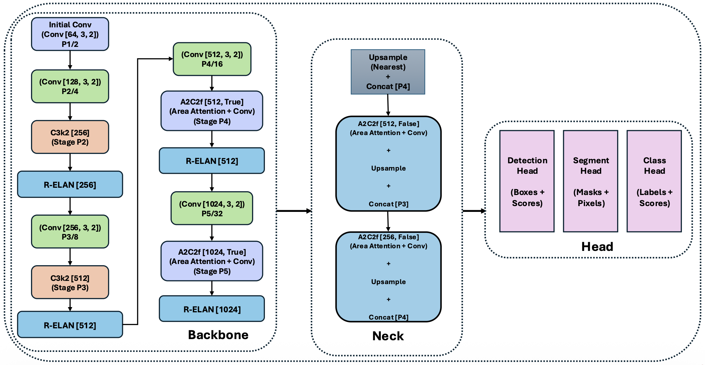
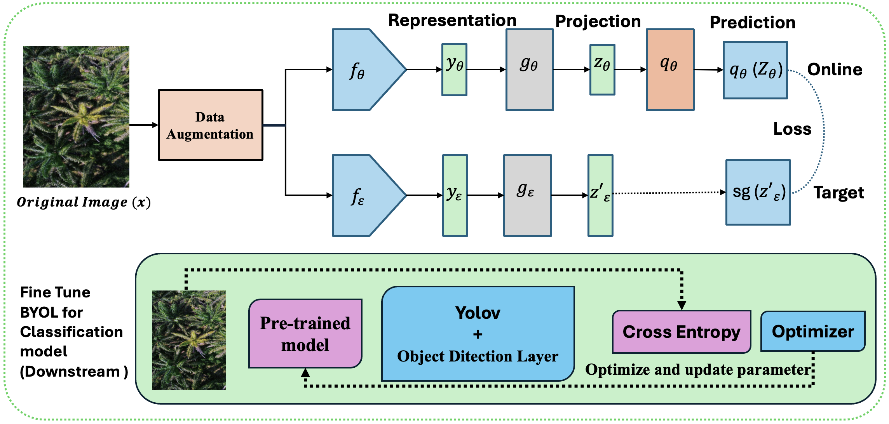
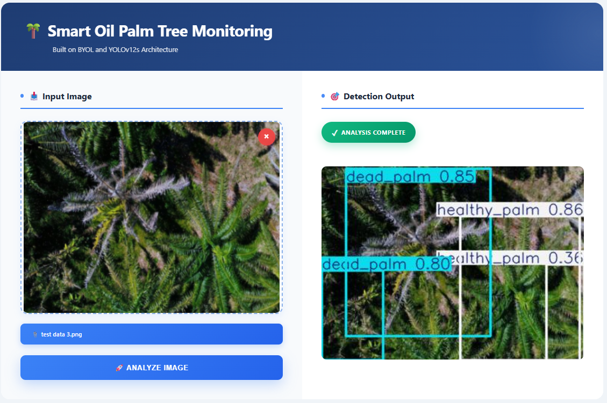

## Drone-Based Monitoring of Date Palm Trees Using a Self-Supervised and Semi-Supervised YOLOv12s Backbone

| | | |
|---|---|---|
|  |  |  |
|  |  |  |

### ABSTRACT
Date palm trees are a key economic crop in arid regions, and accurately locating and monitoring individual trees and their health status is crucial for yield forecasting and plantation management. In this work, we address palm-tree object detection and health classification in UAV imagery using the Dat Palm Fx dataset, which contains 4,802 annotated images with three health classes (healthy, abnormal, dead). We take YOLOv12s as a fully supervised baseline detector, and further investigate a semi-supervised approach (Soft Teacher) and two self-supervised pretraining strategies (BYOL and SimCLR) for improving detection performance under limited labeled data. Our final model couples BYOL pretraining with a YOLOv12s backbone and
is fine-tuned on the labeled portion of Dat Palm Fx. The proposed BYOL–YOLOv12s detector attains a mean precision of 0.9317, recall of 0.8994, mAP@0.50 of 0.9609, and mAP@0.50:0.95 of 0.7255 on the validation set, and 0.9078 precision,0.9070 recall, 0.9569 mAP@0.50, and 0.6925 mAP@0.50:0.95 on the held-out test set. Compared with the supervised baseline and the semi-supervised and alternative self-supervised variants, the BYOL-based model consistently yields the best trade-off between precision and recall. Finally, we deploy the trained detector in a web-based monitoring system that visualizes detections and healt  maps from drone imagery, providing a practical and scalable tool for automated palm plantation health monitoring.

### Methodology

This repository implements a complete UAV-based pipeline for date palm tree detection and health-status monitoring using a YOLOv12s detector enhanced with self-supervised (BYOL, SimCLR) and semi-supervised (Soft Teacher) learning strategies.The overall research workflow, illustrated in 1, presents the complete pipeline for the proposed approach: 

### Dataset

We use the **Dat Palm Fx** dataset (Roboflow Universe), consisting of **4,802 RGB UAV images** annotated with axis-aligned bounding boxes. Each palm instance belongs to one of three health-condition classes:

* **healthy_palm**
* **abnormal_palm**
* **dead_palm**

### Class Distribution

  

### Data Augmentation

We apply Albumentations-based augmentation **only on the training split** to improve robustness against:

* viewpoint/scale variation
* illumination changes
* cluttered backgrounds (soil, shadows, buildings)

| Split     | Original | Augmented |     Extra |   Labels |
| --------- | -------: | --------: | --------: | -------: |
| Train     |     3855 |      5355 |     +1500 |     5355 |
| Valid     |      200 |       200 |        +0 |      200 |
| Test      |      747 |       747 |        +0 |      747 |
| **Total** | **4802** |  **6302** | **+1500** | **6302** |

### Models & Implementation

🧱 Backbone benchmarking  
We first trained three lightweight detectors: YOLOv10s, YOLOv11s, and YOLOv12s using the same
dataset split, input size (640 × 640 ), and training setup to ensure a fair comparison. Among the tested backbones, YOLOv12s
achieved the best overall detection performance and showed more stable learning behavior. Therefore, we chose YOLOv12s as
the baseline backbone for the rest of this study.

**Figure:** YOLOv12s architecture used as the baseline detector backbone.

🧠 Learning strategies  
After selecting YOLOv12s, we explored methods to further improve generalization under plantation
conditions (e.g., changes in viewpoint, illumination, canopy density, and background). We evaluated (i) a semi-supervised
detection method (Soft Teacher) and (ii) two self-supervised learning (SSL) methods (BYOL and SimCLR). For SSL, we
removed the detection head and used the YOLOv12s backbone as an encoder to learn strong visual representations from
augmented views of the same image. After pretraining, we re-attached the detection head and fine-tuned the full detector on the
labeled training set.

🧩 Proposed model  
In our experiments, BYOL produced the most effective representations and achieved the highest
accuracy after fine-tuning. For this reason, our proposed system uses a BYOL-pretrained YOLOv12s backbone as the final
detection model.

**Figure:** BYOL pretraining architecture used to initialize the YOLOv12s backbone. The online network (encoder–projector–predictor) learns to match the target network (encoder–projector), updated via EMA, across two augmented views of the same UAV image.

## Training Setup

All experiments run on **Kaggle** with:
- **2× NVIDIA T4 GPUs**
- **CUDA 12.4**
- **PyTorch 2.6.0**
- **Ultralytics YOLO framework**

To ensure fairness across comparisons:
- Same input size: **640×640** (YOLO fine-tuning)
- Same training budget: **up to 70 epochs**
- **SGD** optimizer, momentum **0.937**
- EMA **0.996**
- Cosine LR schedule, initial LR = **1e-3**
- Early stopping patience = **7**

### Supervised YOLO hyperparameters (our settings)

| Hyperparameter | YOLOv12-s | YOLOv11-s | YOLOv10-s |
|---|---:|---:|---:|
| Pretrained Weights | yolov12s.pt | yolov11s.pt | yolov10s.pt |
| Image Size | 640 | 640 | 640 |
| Batch Size | 8 | 8 | 8 |
| Epochs (max) | 70 | 70 | 70 |
| Early Stopping | patience=7 | patience=7 | patience=7 |
| LR (init) | 1e-3 | 1e-3 | 1e-3 |
| LR Schedule | cosine | cosine | cosine |
| Optimizer | SGD | SGD | SGD |
| Momentum | 0.937 | 0.937 | 0.937 |
| EMA | 0.996 | 0.996 | 0.996 |
| Weight Decay | 5e-4 | 5e-4 | 5e-4 |
| Warm-up | 3 epochs | 3 epochs | 3 epochs |
| Loss | BCE + DFL | BCE + DFL | BCE + DFL |
| AMP | True | True | True |

**Table 2. Controlled training settings used to compare YOLO backbones under identical compute budget and preprocessing.**

### SSL & semi-supervised pipeline settings

| Setting | Soft Teacher–Student | SimCLR | BYOL |
|---|---:|---:|---:|
| Paradigm | Semi-supervised | Self-supervised | Self-supervised |
| Labeled/Unlabeled | 20% / 80% | — | — |
| SSL Optimizer | — | AdamW | AdamW |
| SSL LR | — | 1e-3 | 1e-3 |
| SSL WD | — | 1e-4 | 1e-4 |
| SSL Image Size | — | 320 | 320 |
| SSL Batch | — | 8 | 8 |
| SSL Epochs | — | 70 | 70 |
| SSL Loss | — | NT-Xent | BYOL loss |
| Projection Head | — | hidden=2048, out=128 | proj: 512→256; pred: 256→512→256 |
| Temp / EMA | — | T=0.2 | m0=0.996 |
| Pseudo-label conf | 0.6 | — | — |
| NMS IoU | 0.5 | — | — |
| Fine-tune imgsz | 640 | 640 | 640 |
| Fine-tune opt | SGD | SGD | SGD |

**Table 3. Hyperparameters for Soft Teacher, SimCLR, and BYOL pipelines used under a fixed training budget for direct comparison.**

## Experimental Results & Performance Analysis

This section reports quantitative results and learning dynamics for supervised baselines, semi-supervised learning (Soft Teacher), and self-supervised pretraining (BYOL, SimCLR). All models were trained with the same protocol (max 70 epochs, Early Stopping patience=7), and the best checkpoint was selected based on validation performance. Final scores are reported on the held-out test split using **Precision**, **Recall**, **mAP@0.50**, and **mAP@0.50:0.95** (stricter localization metric).

---

### 1) Supervised Baselines (YOLOv10s / YOLOv11s / YOLOv12s)

We first benchmark three lightweight YOLO detectors as fully supervised baselines for UAV-based palm monitoring. All models are trained under identical settings to ensure a controlled comparison.

| Model   | Precision | Recall | mAP@0.50 | mAP@0.50:0.95 |
|--------|----------:|-------:|---------:|--------------:|
| YOLOv10s | 0.8860 | **0.9062** | **0.9493** | 0.6852 |
| YOLOv11s | 0.9045 | 0.8848 | 0.9482 | 0.6712 |
| YOLOv12s | **0.9182** | 0.8724 | 0.9446 | **0.6842** |

**Table 4. Test-set detection performance of supervised YOLO baselines on Dat Palm Fx, showing precision–recall trade-offs and strict localization accuracy (mAP@0.50:0.95).**

**Key observations**
- All detectors achieve high mAP@0.50 (≈0.944–0.949), confirming YOLO-style models are effective for aerial palm detection.
- **YOLOv10s** yields the highest **Recall (0.9062)** and best **mAP@0.50 (0.9493)** → strongest sensitivity (fewer missed palms).
- **YOLOv12s** achieves the best **Precision (0.9182)** and strongest **mAP@0.50:0.95 (0.6842)** → fewer false alarms and more accurate localization under strict IoU thresholds.

#### Which YOLO is preferable for UAV plantation monitoring?
Operational UAV monitoring often requires (i) reliable crown localization in dense scenes and (ii) controlled false positives to reduce unnecessary field checks. Under these constraints, **YOLOv12s is the preferred default baseline** due to its higher precision and strict-IoU performance.  
If the priority is **maximizing sensitivity** (e.g., screening for all potentially abnormal/dead palms), **YOLOv10s is an attractive alternative** because of its superior recall.

---

### 2) Semi-Supervised Learning (Soft Teacher–Student, 20% labeled / 80% unlabeled)

To evaluate learning under limited annotation, we apply a **Soft Teacher teacher–student pipeline** with:
- **20% labeled training data (𝒟_L)**
- **80% unlabeled training data (𝒟_U)** (labels discarded)
- Teacher generates pseudo-labels on 𝒟_U (**conf=0.6**, **NMS IoU=0.5**)
- Student trains on labeled + pseudo-labeled union  
Validation and test sets remain fully labeled and are never used for pseudo-labeling.

| Model   | Supervision | Precision | Recall | mAP@0.50 | mAP@0.50:0.95 |
|--------|-------------|----------:|-------:|---------:|--------------:|
| Teacher | 20% labeled only | **0.9231** | **0.9155** | **0.9669** | **0.7200** |
| Student | 20% labeled + pseudo-labels | 0.9108 | 0.8959 | 0.9501 | 0.7151 |

**Table 5. Test-set performance of Soft Teacher–Student semi-supervised training with 20% labeled data, reporting both teacher-only and student-with-pseudo-label outcomes.**

**Key observations**
- Even with only **20% labeled data**, the **teacher** achieves strong detection and localization (mAP@0.50:0.95 = **0.7200**).
- The **student** trained with pseudo-labels remains competitive (mAP@0.50:0.95 = **0.7151**), confirming unlabeled UAV imagery can be exploited effectively.
- The slight drop in the student’s strict-IoU metrics is consistent with **pseudo-label noise propagation** (e.g., missing or slightly misaligned boxes), a known limitation in dense aerial scenes.

---

### 3) Self-Supervised Pretraining (BYOL vs SimCLR) + YOLOv12s Fine-Tuning

We further evaluate whether SSL pretraining improves detection under limited labels by pretraining the **YOLOv12s backbone** using:
- **BYOL (bootstrap-based SSL)**
- **SimCLR (contrastive SSL, NT-Xent)**  
After SSL pretraining, we re-attach the detection head and fine-tune on the labeled split.

| SSL Method | Model | Precision | Recall | mAP@0.50 | mAP@0.50:0.95 |
|-----------|-------|----------:|-------:|---------:|--------------:|
| BYOL   | YOLOv12s | 0.9084 | **0.9226** | **0.9601** | **0.7086** |
| SimCLR | YOLOv12s | 0.9023 | 0.9094 | 0.9561 | 0.7011 |

**Table 6. Test-set performance of SSL-initialized YOLOv12s detectors after downstream fine-tuning, highlighting transfer benefits from self-supervised representation learning.**

**Key observations**
- Both SSL strategies transfer well, achieving strong mAP@0.50 (≈0.956–0.960) and balanced precision/recall.
- **Strict localization (mAP@0.50:0.95)** remains harder due to canopy overlap, scale variation, and partial occlusion in UAV imagery.
- **BYOL + YOLOv12s** achieves the strongest overall trade-off, with the best mAP@0.50 (**0.9601**) and mAP@0.50:0.95 (**0.7086**).

---

## Ablation Study (BYOL–YOLOv12s Optimization Sensitivity)

To quantify how sensitive the proposed **BYOL–YOLOv12s** pipeline is to optimization settings, we perform an ablation study over three key hyperparameters: **learning rate (LR)**, **weight decay (WD)**, and **EMA momentum**. The baseline configuration uses **LR = 1e-3**, **WD = 1e-4**, **EMA = 0.996**, and a fixed training budget of **70 epochs**. Starting from this baseline, we vary one factor at a time (and also evaluate a small set of combined configurations) while keeping all other settings unchanged. Performance is reported on the **validation set** using **mAP@0.50** and **mAP@0.50:0.95**.

| Setting | SSL | Backbone | Epochs | LR | WD | EMA | mAP@0.50 | mAP@0.50:0.95 |
|---|---|---|---:|---:|---:|---:|---:|---:|
| Baseline | BYOL | YOLOv12s | 70 | 1e-3 | 1e-4 | 0.996 | 0.9569 | 0.6925 |
| Lower LR | BYOL | YOLOv12s | 70 | 5e-4 | 1e-4 | 0.996 | 0.9601 | 0.7086 |
| Higher LR | BYOL | YOLOv12s | 70 | 2e-3 | 1e-4 | 0.996 | 0.9570 | 0.6963 |
| No WD | BYOL | YOLOv12s | 70 | 1e-3 | 0 | 0.996 | 0.9485 | 0.6731 |
| **Smaller WD** | BYOL | YOLOv12s | 70 | 1e-3 | **1e-5** | **0.996** | **0.9631** | 0.7086 |
| Larger WD | BYOL | YOLOv12s | 70 | 1e-3 | 1e-3 | 0.996 | 0.9606 | 0.7054 |
| Lower EMA | BYOL | YOLOv12s | 70 | 1e-3 | 1e-4 | 0.990 | 0.9598 | 0.7178 |
| Higher EMA | BYOL | YOLOv12s | 70 | 1e-3 | 1e-4 | 0.999 | 0.9599 | 0.7165 |
| Small LR + Small WD + Low EMA | BYOL | YOLOv12s | 70 | 5e-4 | 1e-5 | 0.990 | 0.9573 | 0.7024 |
| Large LR + Large WD + High EMA | BYOL | YOLOv12s | 70 | 2e-3 | 1e-3 | 0.999 | 0.9596 | **0.7243** |

**Table 7. Optimization ablation for BYOL-pretrained YOLOv12s on the validation split, showing the impact of learning rate, weight decay, and EMA momentum on coarse detection quality (mAP@0.50) and strict localization (mAP@0.50:0.95). Best values are highlighted.**

### Findings (What matters and why)
- **Baseline is strong but not optimal.** Several small changes yield measurable improvements.
- **Learning rate:** Reducing LR to **5e-4** improves both mAP@0.50 and mAP@0.50:0.95, while increasing LR to **2e-3** provides no benefit and slightly degrades stability—suggesting the model is near its optimization limit at higher LR.
- **Weight decay is essential:** Removing WD causes a clear drop in both metrics, confirming that regularization remains necessary even with SSL initialization.
- **Best mAP@0.50:** The highest mAP@0.50 (**0.9631**) is achieved with a **mild, non-zero WD = 1e-5**, indicating that BYOL-pretrained features often require *lighter* regularization during fine-tuning.
- **Best strict localization:** The highest mAP@0.50:0.95 (**0.7243**) appears with a **coordinated setting (LR=2e-3, WD=1e-3, EMA=0.999)**, suggesting that strict-IoU localization benefits from tuned EMA dynamics and stronger regularization when training becomes more aggressive.

**Practical takeaway:**  
- If you care most about **overall detection quality**, use **WD = 1e-5** (with LR=1e-3, EMA=0.996).  
- If you prioritize **tight bounding-box localization**, consider tuning EMA and adopting the strong combined configuration that maximizes mAP@0.50:0.95.

---

## Web Application Deployment (Smart Palm Tree Monitoring)

To support real-world use by agronomists and plantation managers, we deploy the trained **BYOL–YOLOv12s** model in an interactive web system called **Smart Palm Tree Monitoring**. The application provides an intuitive workflow for uploading UAV imagery, running server-side inference, and visualizing results as annotated detections in real time.

### System behavior
- Upload a drone image through a browser UI
- Server performs inference via a REST-style endpoint
- Client receives:
  - bounding boxes
  - class labels (**healthy**, **abnormal**, **dead**)
  - confidence scores
- Output is rendered as color-coded overlays on the original image
- The app also summarizes per-image statistics (e.g., total palms and health-class distribution) for logging/export

**Figure 14. Smart Palm Tree Monitoring web interface for field deployment: the left panel displays the uploaded UAV image, while the right panel shows BYOL–YOLOv12s detection outputs with class labels and confidence scores overlaid for rapid, interpretable inspection.**

---

