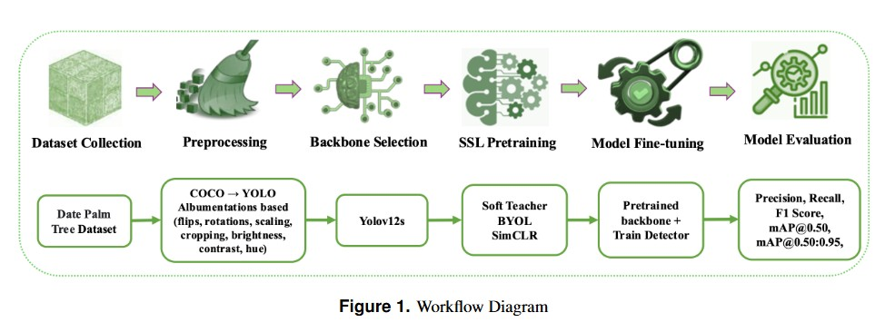

## Drone-Based Monitoring of Date Palm Trees Using a Self-Supervised and Semi-Supervised YOLOv12s Backbone

| | | |
|---|---|---|
|  |  |  |
|  |  |  |

### ABSTRACT
Date palm trees are a key economic crop in arid regions, and accurately locating and monitoring individual trees and their health status is crucial for yield forecasting and plantation management. In this work, we address palm-tree object detection and health classification in UAV imagery using the Dat Palm Fx dataset, which contains 4,802 annotated images with three health classes (healthy, abnormal, dead). We take YOLOv12s as a fully supervised baseline detector, and further investigate a semi-supervised approach (Soft Teacher) and two self-supervised pretraining strategies (BYOL and SimCLR) for improving detection performance under limited labeled data. Our final model couples BYOL pretraining with a YOLOv12s backbone and
is fine-tuned on the labeled portion of Dat Palm Fx. The proposed BYOL–YOLOv12s detector attains a mean precision of 0.9317, recall of 0.8994, mAP@0.50 of 0.9609, and mAP@0.50:0.95 of 0.7255 on the validation set, and 0.9078 precision,0.9070 recall, 0.9569 mAP@0.50, and 0.6925 mAP@0.50:0.95 on the held-out test set. Compared with the supervised baseline and the semi-supervised and alternative self-supervised variants, the BYOL-based model consistently yields the best trade-off between precision and recall. Finally, we deploy the trained detector in a web-based monitoring system that visualizes detections and healt  maps from drone imagery, providing a practical and scalable tool for automated palm plantation health monitoring.

### Methodology

This repository implements a complete UAV-based pipeline for date palm tree detection and health-status monitoring using a YOLOv12s detector enhanced with self-supervised (BYOL, SimCLR) and semi-supervised (Soft Teacher) learning strategies.The overall research workflow, illustrated in 1, presents the complete pipeline for the proposed approach: 

### Dataset

We use the **Dat Palm Fx** dataset (Roboflow Universe), consisting of **4,802 RGB UAV images** annotated with axis-aligned bounding boxes. Each palm instance belongs to one of three health-condition classes:

* **healthy_palm**
* **abnormal_palm**
* **dead_palm**

### Class Distribution

